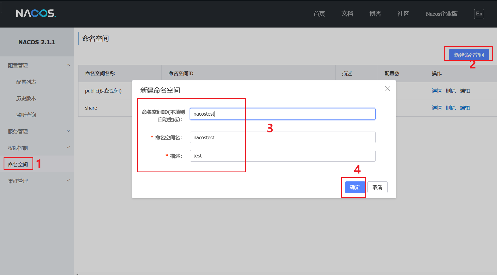
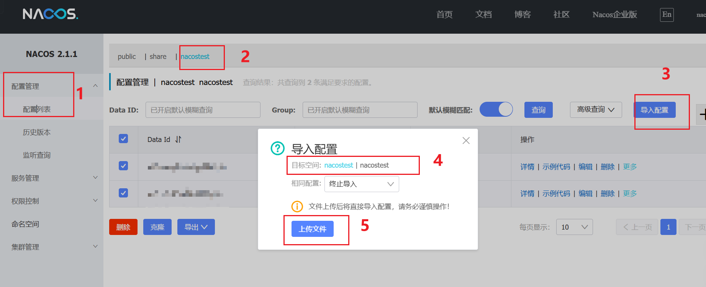

#

使用nacos用作注册中心和配置中心。

## 启动nacos

使用docker-compose.yml创建nacos并启动。


## 配置 nacos
登录 ip:8848  nacos/nacos，创建命名空间，名称和id都是nacostest，见下图：



导入配置，见docs/nacos_config_export_*.zip



## 修改代码配置

- service-consumer中的bootstrap.yml中的nacos地址
- service-provider中的bootstrap.yml中的nacos地址

## 启动service-consumer和service-provider

通过service-consumer请求接口，
```shell
curl --location 'http://localhost:8071/echo1.do' -H 'Content-Type: text/plain' --data 'by-echo1'
```

```shell
curl --location 'http://localhost:8071/echo2.do' -H 'Content-Type: text/plain' --data 'by-echo2'
```

完成。

## shareConfigs怎么使用？

shared-configs：存放mysql/redis/actuator/minio等公用配置。

